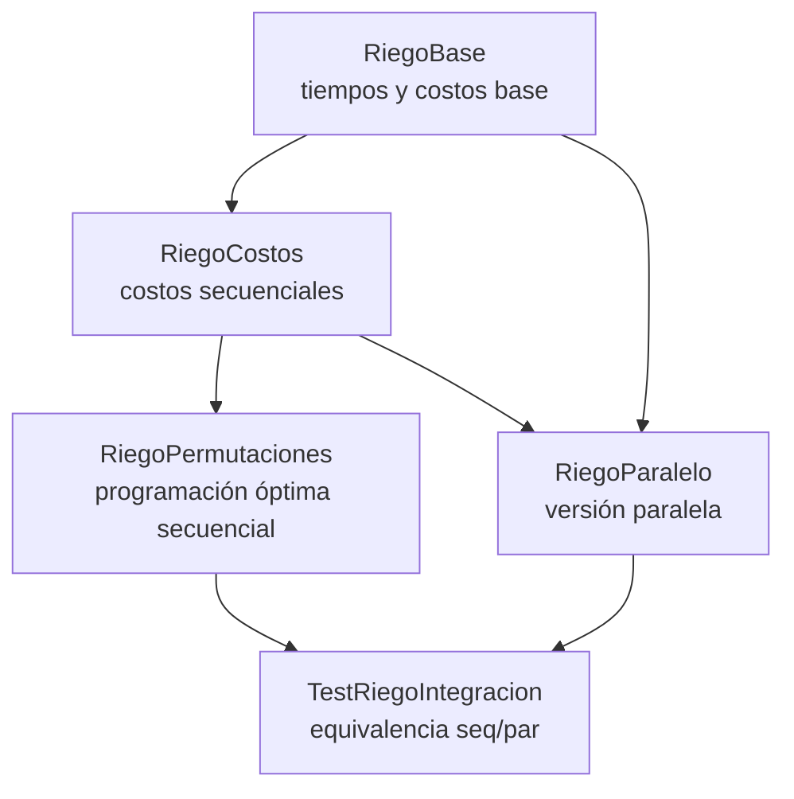

# Ejemplo informe de corrección

**Fundamentos de Programación Funcional y Concurrente**  
Documento realizado por el docente Juan Francisco Díaz.

---

## Argumentación de corrección de programas

### Argumentando sobre corrección de programas recursivos

Sea $f : A \to B$ una función, y $A$ un conjunto definido recursivamente (recordar definición de matemáticas discretas I), como por ejemplo los naturales o las listas.

Sea $P_f$ un programa recursivo (lineal o en árbol) desarrollado en Scala (o en cualquier lenguaje de programación) hecho para calcular $f$:

```scala
def Pf(a: A): B = { // Pf recibe a de tipo A, y devuelve f(a) de tipo B
  ...
}
```

¿Cómo argumentar que \$P_f(a)\$ siempre devuelve \$f(a)\$ como respuesta? Es decir, ¿cómo argumentar que \$P_f\$ es correcto con respecto a su especificación?

La respuesta es sencilla, demostrando el siguiente teorema:

$$
\forall a \in A : P_f(a) == f(a)
$$

Cuando uno tiene que demostrar que algo se cumple para todos los elementos de un conjunto definido recursivamente, es natural usar **inducción estructural**.

En términos prácticos, esto significa demostrar que:

- Para cada valor básico \$a\$ de \$A\$, se tiene que \$P_f(a) == f(a)\$.
- Para cada valor \$a \in A\$ construido recursivamente a partir de otro(s) valor(es) \$a' \in A\$, se tiene que \$P_f(a') == f(a') \rightarrow P_f(a) == f(a)\$ (hipótesis de inducción).

---

#### Ejemplo: Factorial Recursivo

Sea \$f : \mathbb{N} \to \mathbb{N}\$ la función que calcula el factorial de un número natural, \$f(n) = n!\$.

Programa en Scala:

```scala
def Pf(n: Int): Int = {
  if (n == 0) 1 else n * Pf(n - 1)
}
```

Queremos demostrar que:

$$
\forall n \in \mathbb{N} : P_f(n) == n!
$$

- **Caso base**: \$n = 0\$

$$
P_f(0) \to 1 \quad \land \quad f(0) = 0! = 1
$$

Entonces \$P_f(0) == f(0)\$.

- **Caso inductivo**: \$n = k+1\$, \$k \geq 0\$.

$$
P_f(k+1) \to (k+1) \cdot P_f(k)
$$

Usando la hipótesis de inducción:

$$
\to (k+1) \cdot k! = (k+1)!
$$

Por lo tanto, \$P_f(k+1) == f(k+1)\$.

**Conclusión**: \$\forall n \in \mathbb{N} : P_f(n) == n!\$

---

#### Ejemplo: El máximo de una lista

Sea \$f : \text{List}\[\mathbb{N}] \to \mathbb{N}\$ la función que calcula el máximo de una lista no vacía.

Programa en Scala:

```scala
def maxLin(l: List[Int]): Int = {
  if (l.tail.isEmpty) l.head
  else math.max(maxLin(l.tail), l.head)
}
```

Queremos demostrar que:

$$
\forall n \in \mathbb{N} \setminus \{0\} :
P_f(\text{List}(a_1, \ldots, a_n)) == f(\text{List}(a_1, \ldots, a_n))
$$

- **Caso base**: \$n=1\$.

$$
P_f(\text{List}(a_1)) \to a_1 \quad \land \quad f(\text{List}(a_1)) = a_1
$$

- **Caso inductivo**: \$n=k+1\$.

$$
P_f(L) \to \text{math.max}(P_f(\text{List}(a_2, \ldots, a_{k+1})), a_1)
$$

Dependiendo del mayor entre \$a_1\$ y \$b\$ (el máximo del resto de la lista), se cumple que \$P_f(L) == f(L)\$.

**Conclusión**:

$$
\forall n \in \mathbb{N} \setminus \{0\} : P_f(\text{List}(a_1, \ldots, a_n)) == f(\text{List}(a_1, \ldots, a_n))
$$

---

### Argumentando sobre corrección de programas iterativos

Para argumentar la corrección de programas iterativos, se debe formalizar cómo es la iteración:

- Representación de un estado \$s\$.
- Estado inicial \$s_0\$.
- Estado final \$s_f\$.
- Invariante de la iteración \$\text{Inv}(s)\$.
- Transformación de estados \$\text{transformar}(s)\$.

Programa iterativo genérico:

```scala
def Pf(a: A): B = {
  def Pf_iter(s: Estado): B =
    if (esFinal(s)) respuesta(s) else Pf_iter(transformar(s))
  Pf_iter(s0)
}
```

---

#### Ejemplo: Factorial Iterativo

```scala
def Pf(n: Int): Int = {
  def Pf_iter(i: Int, n: Int, ac: Int): Int =
    if (i > n) ac else Pf_iter(i + 1, n, i * ac)
  Pf_iter(1, n, 1)
}
```

- Estado \$s = (i, n, ac)\$
- Estado inicial \$s_0 = (1, n, 1)\$
- Estado final: \$i = n+1\$
- Invariante: \$\text{Inv}(i,n,ac) \equiv i \leq n+1 \land ac = (i-1)!\$
- Transformación: \$(i, n, ac) \to (i+1, n, i \cdot ac)\$

Por inducción sobre la iteración, se demuestra que al llegar a \$s_f\$, \$ac = n!\$.

---

#### Ejemplo: El máximo de una lista

```scala
def maxIt(l: List[Int]): Int = {
  def maxAux(max: Int, l: List[Int]): Int = {
    if (l.isEmpty) max
    else maxAux(math.max(max, l.head), l.tail)
  }
  maxAux(l.head, l.tail)
}
```

- Estado \$s = (max, l)\$
- Estado inicial \$s_0 = (a_1, \text{List}(a_2, \ldots, a_k))\$
- Estado final: \$l = \text{List}()\$
- Invariante: \$\text{Inv}(max, l) \equiv max = f(\text{prefijo})\$
- Transformación: \$(max, l) \to (\text{math.max}(max, l.head), l.tail)\$

Por inducción, al llegar al estado final, \$max = f(L)\$.

**Conclusión**:

$$
P_f(L) == f(L)
$$


----

# Informe de Correcion 

En este Informe se presentara el proceso de correcion funcional del sistema de riego, tanto en su version secuencial como en su version paralela. 

- Inducción estructural
- Definiciones matemáticas de las funciones
- Correspondencia entre especificación y programa
- Argumentación sobre recursión y paralelismo

----

## Especificacion Formal

Se define Finca como:

Un conjunto de tablones representado por un vector cada tablón es una tupla `ts, tr, p`

- `ts`: tiempo máximo antes de sufrir
- `tr`: tiempo de riego
- `p`: penalización por sufrimiento

El objetivo es calcular la programación óptima de riego, esto es encontrar un ordenamiento π de los tablones que minimice:

`CostoTotal(π) = CostoRiego(π) + CostoMovilidad(π)`

donde:

- `CostoRiego` se calcula acumulando tiempos y verificando sufrimiento
- `CostoMovilidad` depende del desplazamiento entre tablones

---

# Funciones Recursivas

### Generacion Secuencial de permutaciones

La funcion Matematica deseada:

$$ f(T) = \text{todas las permutaciones del conjunto tablones de T} $$

Codigo :

```scala
def perms(prefix, rem):
if rem vacío → Vector(prefix)
else:
para cada id en rem:
  perms(prefix :+ id, rem - id)
```

---

### Coreccion de las Permutaciones

La función opera sobre listas/vectores, los cuales son conjuntos definidos recursivamente:

- **Caso base:** lista vacía
- **Caso inductivo:** lista con cabeza + cola

Por lo tanto, la corrección se demuestra por inducción estructural.

---

### Caso base

$$ rem = ∅ $$

La implementación retorna:

```scala
Vector(prefix)
```
que coincide con la definicion Matematica:

$$ f(∅) = \{ prefix\} $$

Caso Base Correcto.

---

### Caso Inductivo 

Sea $$ rem = \{x₁, x₂, …, xₙ\} $$

Se asume hipótesis de inducción:

$$ perms(prefix  \cup \{Xi\}, rem - Xi) $$ es correcta. 

Entonces la implementación construye:

```scala
⋃ perms(prefix :+ xᵢ, rem - xᵢ)
```
y esto corresponde exactamente a: 

$$f(rem) = \cup_{i=1}^{n} f(rem-Xi) $$

Por hipótesis de inducción, el caso inductivo es correcto. por lo tanto, `perms` es correcta para todo `rem`.

---

## Correcion de Costo de Riego 


###  Especificacion Matematica


$$ CostoRiegoTablon(i)= \begin{cases} tSi - (ti + tri) & \text{si no sufre} \\  pi((ti + tri)- tsi)   & \text{si sufre} \end{cases} $$

donde:

`tᵢ` = tiempo acumulado antes de llegar al tablón `i`

Codigo: 

```scala
if (ts_i - tr_i >= t_i)
  ts_i - (t_i + tr_i)
else
  p_i * ((t_i + tr_i) - ts_i)
```

### Correcion Caso base

El cálculo depende solo de valores atómicos, no recursivos → trivialmente correcto.

### Correccion Caso Inductivo

`ti` depende de:

`foldleft` sobre el orden

por tanto, la secuencia de tiempos esta definida recursivamente:

- Caso base: `tiempoActual = 0`
- Caso inductivo: `tiempoActual = tiempoActual + tr`

Esto coincide con: 

$$ tk+1 = tk + trk $$
por tanto es correcto.


---

## Corrrecion de Costo Movilidad 

La movilidad esta definida como: 

$$ CostoMovilidad(π)= \sum d(πi,πi+1) $$

Codigo:

```scala
def recorrer(j):
if j >= n-1 → 0
else d(actual)(sig) + recorrer(j+1)
```

Se demuestra por inducción sobre el índice j:

- Caso base: `j = n - 1 → 0`
- Caso inductivo: la ejecución mantiene la suma sobre `j+1`. Por hipótesis de inducción, el resultado es correcto.

----

## Correcion de la version Paralela 


La versión paralela usa:

- Computación por tablón en paralelo
- Suma paralela
- Evaluación independiente de pares de movilidad
- Paralelización del branching en permutaciones

#### Propiedad clave:

Todas las tareas paralelizadas son independientes entre sí. Como:

- Costo por tablón depende únicamente de su orden
- Costo de movilidad depende solo de pares consecutivos
- Permutaciones se dividen en ramas independientes

Entonces:

$$Pf(a1),Pf(a2),...,Pf(an) $$

pueden evaluarse en paralelo sin afectar su valor.

su equivalencia es: 

$$ProgramacionRiegoOptimo(f,d) = ProgramacionRiegoOptimoPar(f,d) $$

Esto verifica mediante:

- induccion sobre permutaciones
- Propiedades de independencias
- Test formales

---

# Pila de llamados



---

