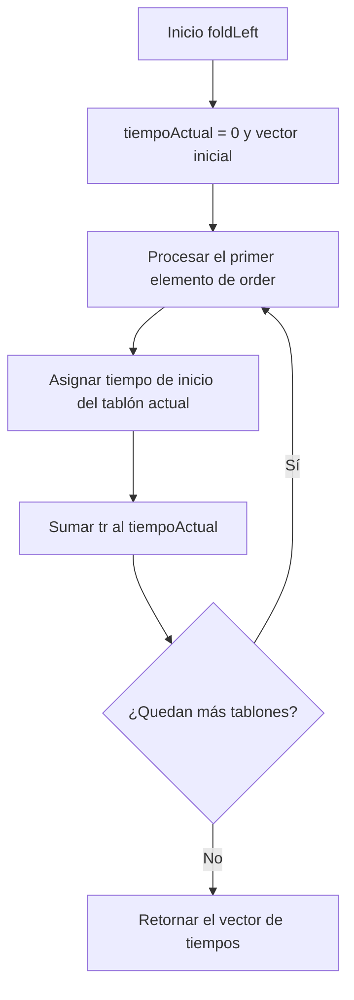
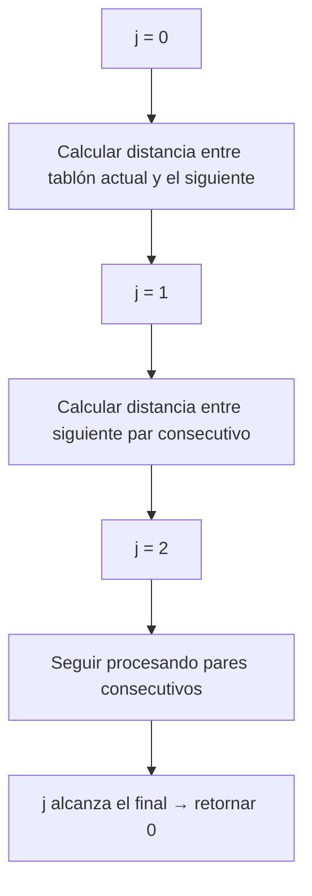
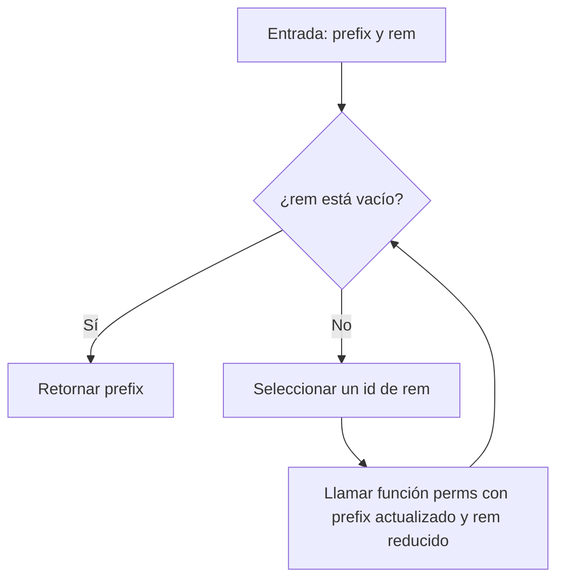
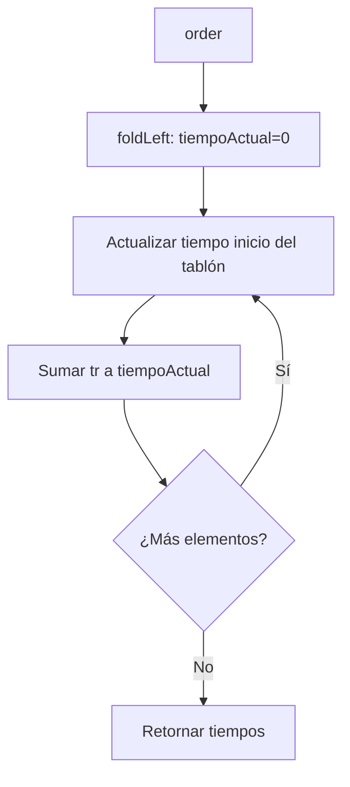
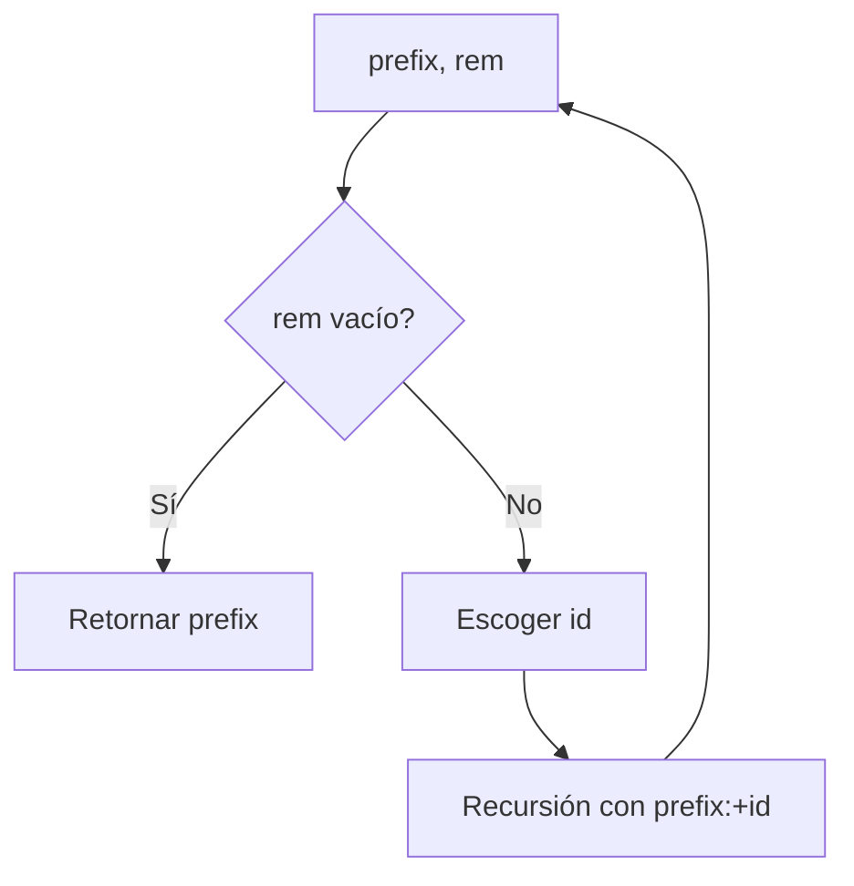
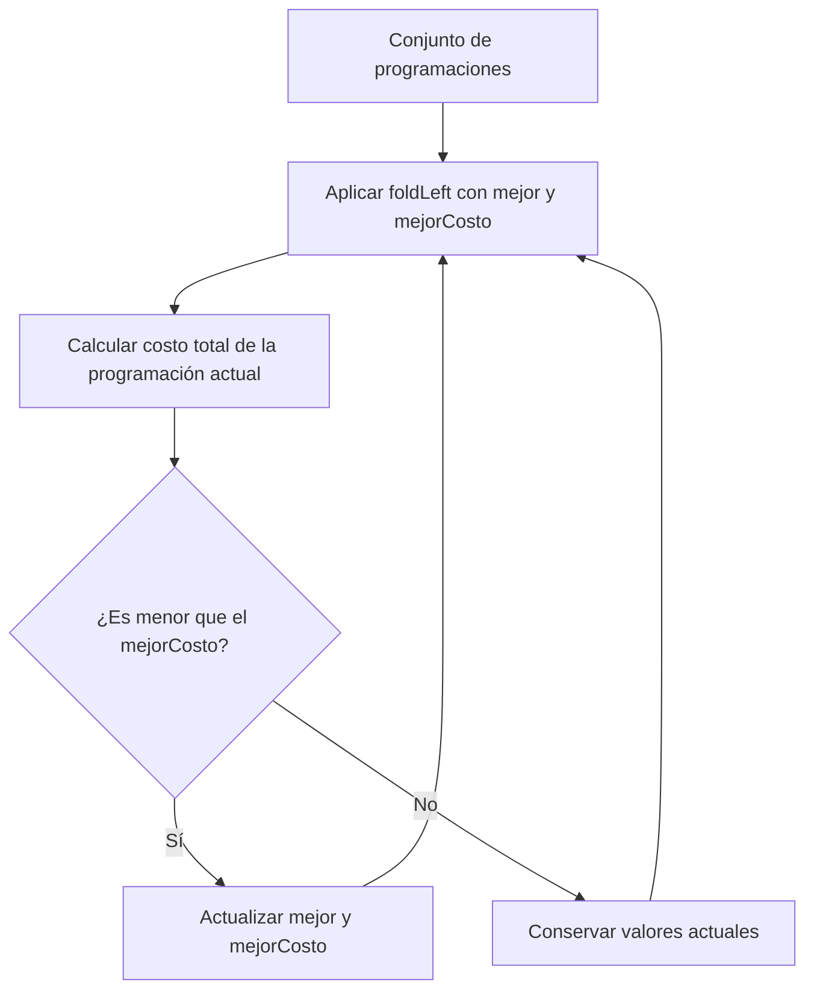
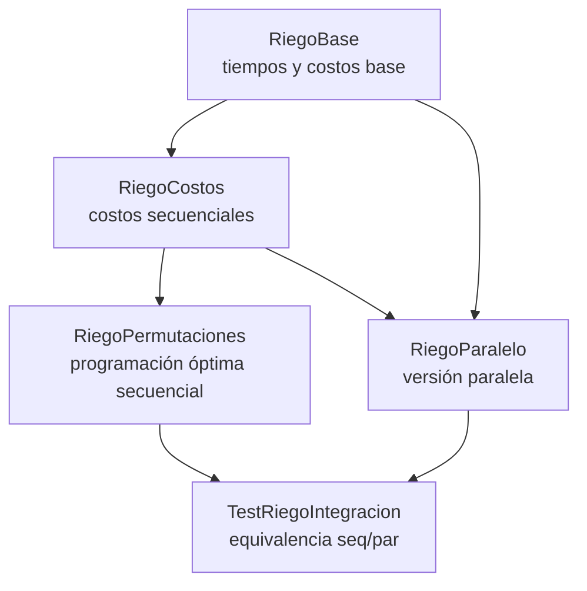

# 📘 Informe de Proceso – Sistema de Riego 
**Programación Funcional – Proyecto Final**

---

##  Introducción

El presente informe describe el **proceso de construcción del sistema secuencial de programación de riego** desarrollado en Scala. El objetivo general del sistema es determinar:

- Los tiempos de inicio de riego para cada tablón.
- El costo total de riego asociado a una programación.
- El costo de movilidad entre tablones.
- La programación óptima (secuencial) que minimiza los costos totales.

El enfoque utilizado se basa estrictamente en **programación funcional**, respetando:

- Inmutabilidad
- Recursión
- Eliminación total de estructuras imperativas (`var`, `while`, `return`, etc.)
- Uso de funciones puras
- Estructuras inmutables como `Vector`

Este documento describe el proceso de diseño y construcción del sistema secuencial y además incluye las actividades de evaluación y paralelización realizadas para el proyecto. En particular se presentan: la implementación secuencial, la versión paralela, el conjunto de pruebas y el benchmarking (mediciones de rendimiento) que permiten evaluar el impacto del paralelismo. Las conclusiones integrales sobre rendimiento y paralelización se incluyen al final del informe.

---

##  Diseño general del sistema

El sistema se diseñó de manera modular, dividida en cuatro componentes principales:

1. **RiegoBase.scala**
    - Tiempos de inicio (tIR)
    - Costo por tablón

2. **RiegoCostos.scala**
    - Costo total de riego
    - Costo de movilidad entre tablones

3. **RiegoPermutaciones.scala**
    - Generación recursiva de permutaciones
    - Selección óptima basada en costo secuencial

4. **RiegoIntegracion.scala**
    - Generadores determinísticos de fincas y distancias
    - Validación general del sistema secuencial

El sistema utiliza un modelo de datos simple e inmutable:

- `Tablon = (ts, tr, p)`
- `Finca = Vector[Tablon]`
- `ProgRiego = Vector[Int]`
- `Distancia = Vector[Vector[Int]]`

Este modelo mantiene claridad conceptual y compatibilidad con programación funcional pura.

---

##  Proceso de construcción del módulo base (`RiegoBase.scala`)

Este módulo constituye el núcleo matemático del proyecto.

---

###  Representación de datos

Cada tablón se modela como una tupla:

`(ts_i, tr_i, p_i)`

donde:

- `ts_i`: tiempo límite antes de sufrir
- `tr_i`: tiempo de riego
- `p_i`: penalización por sufrimiento

Una finca es un vector de estos tablones (`Vector[Tablon]`), y una programación es un vector de enteros representando el orden de riego (`ProgRiego`).

---

### Construcción de `tIR_fromOrder`

El objetivo es calcular el tiempo de inicio de cada tablón dadas las reglas:

$$t_{\Pi_{\pi_0}} = 0,\qquad t_{\Pi_{\pi_j}} = t_{\Pi_{\pi_{j-1}}} + tr_{\Pi_{\pi_{j-1}}}$$

Se utilizó `foldLeft` para mantener un diseño totalmente funcional y libre de mutabilidad.

**Diagrama del proceso:**


Ejemplo para `order = [2,0,1]`:
- Tablón 2 inicia en 0
- Tablón 0 inicia en tr₂
- Tablón 1 inicia en tr₂ + tr₀

---
### Construcción de `tIR_fromMapping`

Una programación también puede venir dada como mapping, donde:
```scala
mapping(i) = turno en el que riega el tablón i
```
Para convertirlo en una permutación real:
```scala
order(turno) = idTablon
```
Se usó nuevamente `foldLeft` para mantener la inmutabilidad del vector base.

---
### Función `tIR`
Un wrapper semántico para llamar directamente a `tIR_fromOrder`.

---
### Construcción de `costoRiegoTablon`
Se implementó según las reglas del profesor:
- Caso sin sufrimiento:
Un tablón $i$ no sufre si se cumple la condición:
  $$ts_i - tr_i \ge t_i$$
  En este caso, el costo de riego está dado por:
  $$CR_i = ts_i - (t_i + tr_i)$$

- Caso con sufrimiento:
Si el tablón $i$ inicia riego después del límite permitido:
  $$ts_i - tr_i < t_i$$
  entonces se aplica la penalización proporcional a $p_i$:
  $$CR_i = p_i \cdot \left( (t_i + tr_i) - ts_i \right)$$

El diseño evita condicionales anidados y mantiene claridad lógica.

---
## Proceso del módulo de costos (`RiegoCostos.scala`)
### `costoRiegoFinca`
Se suman los costos individuales usando:
```scala
foldLeft(0)((acc, i) => acc + costoRiegoTablon(i,f,order))
```
Justificación:

- Elimina bucles con estado
- Mantiene inmutabilidad
- Facilita pruebas y composición

### `costoMovilidad`
Se implementó con recursión pura:
```scala
def recorrer(j: Int): Int =
  if (j >= order.length - 1) 0
  else d(order(j))(order(j+1)) + recorrer(j+1)
```
Diagrama del proceso:


---
## Proceso del módulo de permutaciones (`RiegoPermutaciones.scala`)
### Diseño de `generarProgramacionesRiego`
Se implementó una función recursiva basada en:
- `prefix`: permutación en construcción
- `rem`: elementos restantes

Diagrama del algoritmo:


Ventajas del diseño:
- Evita estructuras mutables
- Expresa correctamente la estructura factorial del problema
- Facilita la evaluación secuencial y paralela (en otros módulos)

---
### Selección óptima secuencial

Todas las permutaciones son evaluadas mediante:
```scala
foldLeft((Vector(), Int.MaxValue)) { ... }
```
Cada alternativa evalúa:

- costo total de riego
- costo de movilidad

Y se selecciona la mínima.

Es un enfoque exhaustivo (O(n!)), pero garantiza exactitud para n ≤ 8.

---
## Proceso de integración (`RiegoIntegracion.scala`)
Este módulo introduce:
### Generadores determinísticos
Utilizados para:

- Realizar pruebas controladas
- Reproducir condiciones de evaluación
- Validar integridad del sistema

### Validación del sistema secuencial

Se incluyen funciones de comparación entre componentes del sistema para asegurar consistencia en la lógica base, sin incluir elementos paralelos.

---
## Diagramas Mermaid del proceso global
### Cálculo de tIR

### Permutaciones

### Selección del mejor orden

---
## Reflexión sobre el proceso

El uso de programación funcional ofreció varias ventajas:

- El código es predecible y fácil de razonar.
- La ausencia de estado mutable elimina errores comunes.
- La composición de funciones refleja claramente la lógica del problema.
- `foldLeft` y la recursión permiten expresar algoritmos tradicionales sin efectos secundarios.

Dificultades enfrentadas:

- Evitar completamente estructuras imperativas.
- Manejar la complejidad factorial de permutaciones.
- Diseñar conversiones mapping → orden sin mutabilidad.

Cada una fue resuelta mediante un diseño funcional disciplinado.

---

# Informe de Correcion

En este Informe se presentara el proceso de correcion funcional del sistema de riego, tanto en su version secuencial como en su version paralela.

- Inducción estructural
- Definiciones matemáticas de las funciones
- Correspondencia entre especificación y programa
- Argumentación sobre recursión y paralelismo

----

## Especificacion Formal

Se define Finca como:

Un conjunto de tablones representado por un vector cada tablón es una tupla `ts, tr, p`

- `ts`: tiempo máximo antes de sufrir
- `tr`: tiempo de riego
- `p`: penalización por sufrimiento

El objetivo es calcular la programación óptima de riego, esto es encontrar un ordenamiento π de los tablones que minimice:

`CostoTotal(π) = CostoRiego(π) + CostoMovilidad(π)`

donde:

- `CostoRiego` se calcula acumulando tiempos y verificando sufrimiento
- `CostoMovilidad` depende del desplazamiento entre tablones

---

# Funciones Recursivas

### Generacion Secuencial de permutaciones

La funcion Matematica deseada:

$$ f(T) = \text{todas las permutaciones del conjunto tablones de T} $$

Codigo :

```scala
def perms(prefix, rem):
if rem vacío → Vector(prefix)
else:
para cada id en rem:
  perms(prefix :+ id, rem - id)
```

---

### Coreccion de las Permutaciones

La función opera sobre listas/vectores, los cuales son conjuntos definidos recursivamente:

- **Caso base:** lista vacía
- **Caso inductivo:** lista con cabeza + cola

Por lo tanto, la corrección se demuestra por inducción estructural.

---

### Caso base

$$ rem = ∅ $$

La implementación retorna:

```scala
Vector(prefix)
```
que coincide con la definicion Matematica:

$$ f(∅) = \{ prefix\} $$

Caso Base Correcto.

---

### Caso Inductivo

Sea $$ rem = \{x₁, x₂, …, xₙ\} $$

Se asume hipótesis de inducción:

$$ perms(prefix  \cup \{Xi\}, rem - Xi) $$ es correcta.

Entonces la implementación construye:

```scala
⋃ perms(prefix :+ xᵢ, rem - xᵢ)
```
y esto corresponde exactamente a:

$$f(rem) = \cup_{i=1}^{n} f(rem-Xi) $$

Por hipótesis de inducción, el caso inductivo es correcto. por lo tanto, `perms` es correcta para todo `rem`.

---

## Correcion de Costo de Riego


###  Especificacion Matematica


$$ CostoRiegoTablon(i)= \begin{cases} tSi - (ti + tri) & \text{si no sufre} \\  pi((ti + tri)- tsi)   & \text{si sufre} \end{cases} $$

donde:

`tᵢ` = tiempo acumulado antes de llegar al tablón `i`

Codigo:

```scala
if (ts_i - tr_i >= t_i)
  ts_i - (t_i + tr_i)
else
  p_i * ((t_i + tr_i) - ts_i)
```

### Correcion Caso base

El cálculo depende solo de valores atómicos, no recursivos → trivialmente correcto.

### Correccion Caso Inductivo

`ti` depende de:

`foldleft` sobre el orden

por tanto, la secuencia de tiempos esta definida recursivamente:

- Caso base: `tiempoActual = 0`
- Caso inductivo: `tiempoActual = tiempoActual + tr`

Esto coincide con:

$$ tk+1 = tk + trk $$
por tanto es correcto.


---

## Corrrecion de Costo Movilidad

La movilidad esta definida como:

$$ CostoMovilidad(π)= \sum d(πi,πi+1) $$

Codigo:

```scala
def recorrer(j):
if j >= n-1 → 0
else d(actual)(sig) + recorrer(j+1)
```

Se demuestra por inducción sobre el índice j:

- Caso base: `j = n - 1 → 0`
- Caso inductivo: la ejecución mantiene la suma sobre `j+1`. Por hipótesis de inducción, el resultado es correcto.

----

## Correcion de la version Paralela


La versión paralela usa:

- Computación por tablón en paralelo
- Suma paralela
- Evaluación independiente de pares de movilidad
- Paralelización del branching en permutaciones

#### Propiedad clave:

Todas las tareas paralelizadas son independientes entre sí. Como:

- Costo por tablón depende únicamente de su orden
- Costo de movilidad depende solo de pares consecutivos
- Permutaciones se dividen en ramas independientes

Entonces:

$$Pf(a1),Pf(a2),...,Pf(an) $$

pueden evaluarse en paralelo sin afectar su valor.

su equivalencia es:

$$ProgramacionRiegoOptimo(f,d) = ProgramacionRiegoOptimoPar(f,d) $$

Esto verifica mediante:

- induccion sobre permutaciones
- Propiedades de independencias
- Test formales

---

# Pila de llamados



------ 

# Informe de Paralelización 

## Estrategia de paralelización utilizada

Para la paralelización del sistema de riego se utilizó el **paralelismo de datos**, aprovechando las capacidades de **colecciones paralelas de Scala (`.par`)**, las cuales permiten distribuir automáticamente el trabajo entre los núcleos disponibles del procesador.

La estrategia aplicada se concentró en los siguientes componentes fundamentales del sistema:

---

### Paralelización del costo de riego (`costoRiegoFincaPar`)

Cada tablón de la finca puede evaluarse de manera **independiente**, ya que el costo de riego de un tablón no depende del cálculo de los demás. Por ello, se paralelizó el recorrido de los índices mediante:

```scala

(0 until f.length).toVector.par
      .map(i => RiegoBase.costoRiegoTablon(i, f, order))
      .sum
```

Esto permite que cada tablón sea procesado simultáneamente en distintos hilos.

-------

## Paralelización del costo de movilidad (`costoMovilidadPar`)

El costo de movilidad depende únicamente de los pares consecutivos de la programación. Cada transición (a, b) es independiente, por lo que se transformó el recorrido en pares y se evaluaron en paralelo:

```scala
pares.par.map { case (a,b) => d(a)(b) }.sum
```

-------

## Paralelización de la generación de permutaciones (`generarProgramacionesRiegoPar`)

La generación de permutaciones es el cuello de botella computacional del problema debido a su crecimiento factorial. Se paralelizó el nivel superior del árbol de recursión, dividiendo las ramas principales entre los hilos disponibles:

```scala
rem.zipWithIndex.par.flatMap { ... }
```

Esto permite que múltiples ramas del proceso factorial se exploren simultáneamente.

------

## Paralelización de la búsqueda del óptimo (`ProgramacionRiegoOptimoPar`)

Cada programación posible se evalúa como una tarea independiente, calculando en paralelo:

- El costo de riego paralelo

- El costo de movilidad paralelo

Posteriormente, se selecciona el menor con:

```scala
resultados.minBy(_._2)
```

Así se obtiene la programación óptima sin alterar la correctitud del algoritmo.

------

# Validación de Correctitud

Para verificar que la versión paralela conserva la exactitud del modelo secuencial, se realizaron:

- Pruebas unitarias (`TestRiegoParalelo`)

- Pruebas de integración (`TestRiegoIntegracion`)

- Comparaciones determinísticas y aleatorias

En todos los casos se verificó que:

```scala
ProgramacionRiegoOptimo(f,d) == ProgramacionRiegoOptimoPar(f,d)
``` 

Esto garantiza que la paralelización no altera los resultados del sistema original.

------

## Resultados experimentales (mediciones)

Se ejecutó el benchmark con la implementación actual. A continuación se muestran las mediciones obtenidas (tiempos reportados por ScalaMeter):

| Tamaño (n) | Secuencial (ms) | Paralelo (ms) | Speedup (ratio seq/par) | Observación |
|------------|-----------------|---------------|-------------------------:|-------------|
| 6          | 34.77           | 190.24        | 0.183x                  | Paralelo más lento (≈5.47×) |
| 7          | 40.09           | 110.22        | 0.364x                  | Paralelo más lento (≈2.75×) |
| 8          | 169.00          | 505.54        | 0.334x                  | Paralelo más lento (≈3.00×) |

**Interpretación:** los valores muestran que, para los tamaños probados, la versión paralela tarda más que la versión secuencial (speedup < 1). Esto indica que el overhead de paralelización supera la ganancia en las configuraciones medidas; ver la sección de análisis para explicación detallada.

### Metodología de medición

- Herramienta: ScalaMeter (measure).
- Configuración: ejecución única por tamaño (la salida mostrada es la medida directa de ScalaMeter `measure` en esa ejecución).
- Generación de casos: fincas y matrices aleatorias con seed implícito (util.Random).

------

## Análisis según la Ley de Amdahl

La **Ley de Amdahl** establece que el máximo *speedup* alcanzable por un sistema paralelo está limitado por la fracción secuencial del programa:


$$S(n) = \frac{1}{(1 - P) + \frac{P}{n}}$$


Donde:

- $P$ es la fracción paralelizable del algoritmo.
- $n$ es el número de procesadores.

En este proyecto:

- La parte paralelizable incluye: generación de permutaciones, evaluación de costos y búsqueda del óptimo.
- La parte secuencial está limitada a validaciones, estructuras base y selección final.

En nuestras mediciones observadas:

- El *speedup observado* es menor que 1 para n = 6, 7, 8 (la versión paralela resulta más lenta).
- La razón principal es la **sobrecarga** asociada a las colecciones paralelas y al fork/join: para problemas con trabajo por tarea pequeño (p. ej. calcular costo de 6–8 tablones o generar 720 permutaciones) el costo de administrar tareas paralelas es mayor que el beneficio de ejecutarlas en paralelo.

Conclusión técnica:
- Para problemas factoriales pequeños-medianos la paralelización con `.par` puede no mejorar el rendimiento debido al overhead.
- La Ley de Amdahl sigue siendo válida: aunque la fracción paralelizable sea grande, el coste fijo de paralelización y la pequeña cantidad de trabajo por tarea dominan el tiempo total en estos casos.
------

## Conclusión de la Paralelización

Los experimentos muestran que la versión paralela **es correcta** (ver pruebas) pero **no siempre es más rápida** en la práctica para los tamaños probados. En nuestras mediciones:

- La versión paralela tardó más que la secuencial para n = 6, 7 y 8.
- Esto se debe al overhead de creación y coordinación de tareas en colecciones paralelas frente al reducido trabajo por tarea.

Por lo tanto:

- La implementación paralela **es válida** y mantiene la exactitud del modelo secuencial.
- Sin embargo, **no es beneficiosa en tiempo** para fincas pequeñas/medianas en la máquina donde se ejecutó el benchmark.
- Para escenarios reales con muchos tablones o con carga por tarea mayor, la paralelización puede ser ventajosa; en ese caso conviene probar enfoques alternativos (batching de tareas, heurísticas, paralelismo a mayor granularidad, o frameworks como Futures/Akka/distribuido).

Recomendación práctica: documentar el número de núcleos, hacer múltiples repeticiones, aplicar 'warm-up' y promediar resultados antes de sacar conclusiones de rendimiento.


# Documentación de Casos de Prueba – RiegoBase

Este módulo valida las funciones principales del sistema de riego: cálculo de tiempos de inicio, conversión entre mapeos y órdenes, y cálculo del costo de riego de cada tablón. A continuación se describe de forma breve qué evalúa cada caso de prueba y cuál es el resultado esperado.

---

## Casos de Prueba – `TestRiegoBase`

### 1. tIR_fromOrder – orden simple 0,1,2
**Qué prueba:** Calcula los tiempos de inicio cuando los tablones se riegan en el orden natural.  
**Resultado esperado:** `Vector(0,2,5)`.

### 2. tIR_fromOrder – orden 2,0,1
**Qué prueba:** Verifica que el tiempo acumulado cambia según el orden especificado.  
**Resultado esperado:** `Vector(1,3,0)`.

### 3. tIR_fromOrder – finca de un solo tablón
**Qué prueba:** Caso mínimo con un único tablón.  
**Resultado esperado:** `Vector(0)`.

### 4. tIR_fromMapping – mapping invertido a orden
**Qué prueba:** Revisa que un mapping se convierta correctamente en una permutación real y se calculen sus tiempos.  
**Resultado esperado:** Igual a `tIR_fromOrder(f, Vector(1,2,0))`.

### 5. tIR_fromOrder – verificar contra ejemplo del profesor
**Qué prueba:** Compara tiempos puntuales para asegurar consistencia con un ejemplo externo.  
**Resultado esperado:** `t(2) == 0` y `t(1) == 2`.

### 6. costoRiegoTablon – no sufre
**Qué prueba:** Calcula el costo cuando el tablón se riega antes de su tiempo crítico.  
**Resultado esperado:** `7`.

### 7. costoRiegoTablon – sufre
**Qué prueba:** Verifica la fórmula cuando el tablón se riega tarde y hay penalización.  
**Resultado esperado:** `2`.

### 8. costoRiegoTablon – prioridad alta
**Qué prueba:** Asegura que el costo calculado sea válido cuando el tablón tiene prioridad alta.  
**Resultado esperado:** Costo ≥ 0.

### 9. costoRiegoTablon – orden generado desde mapping
**Qué prueba:** Evalúa compatibilidad entre orden generado desde mapping y cálculo de costo.  
**Resultado esperado:** Un número entero válido.

### 10. costoRiegoTablon – ejemplo general válido
**Qué prueba:** Caso general que garantiza que la función devuelve un entero válido.  
**Resultado esperado:** Un valor entero.
#  RiegoCostos

Este módulo valida el cálculo del costo total de riego de una finca y el costo por movilidad entre tablones según el orden de riego. A continuación se describen brevemente los casos de prueba y sus resultados esperados.

---

## Casos de Prueba – `TestRiegoCostos`

### 1. costoRiegoFinca – finca de un solo tablón
**Qué prueba:** Suma del costo para un único tablón.  
**Resultado esperado:** Igual al costo del tablón 0.

### 2. costoRiegoFinca – dos tablones sin sufrimiento
**Qué prueba:** Cálculo general cuando ningún tablón sufre.  
**Resultado esperado:** Un entero válido.

### 3. costoRiegoFinca – mezcla de sufrimiento
**Qué prueba:** Costo total mezclando casos con sufrimiento y sin sufrimiento.  
**Resultado esperado:** Un entero válido.

### 4. costoRiegoFinca – caso general
**Qué prueba:** Funcionamiento general con varios tablones.  
**Resultado esperado:** Un entero válido.

### 5. costoRiegoFinca – permutación invertida
**Qué prueba:** La función soporta órdenes completamente invertidos.  
**Resultado esperado:** Costo ≥ 0.

---

## Casos de Prueba – `costoMovilidad`

### 6. costoMovilidad – finca de 1 tablón
**Qué prueba:** Sin movimiento entre tablones.  
**Resultado esperado:** `0`.

### 7. costoMovilidad – dos tablones distancia básica
**Qué prueba:** Suma simple de la distancia entre dos posiciones.  
**Resultado esperado:** `4`.

### 8. costoMovilidad – tres tablones con matriz simple
**Qué prueba:** Suma de distancias siguiendo el orden dado.  
**Resultado esperado:** Un entero válido.

### 9. costoMovilidad – distancias variables
**Qué prueba:** Funcionamiento con matriz más compleja.  
**Resultado esperado:** Un entero válido.

### 10. costoMovilidad – caso general
**Qué prueba:** Movilidad con cinco tablones y distancias variadas.  
**Resultado esperado:** Un entero válido.
#  RiegoIntegración

Este archivo describe brevemente cada caso de prueba relacionado con la integración entre los módulos de riego secuencial y paralelo.

---

## 1. Programación óptima en finca vacía
**Objetivo:** Verificar que ambos métodos (secuencial y paralelo) producen la misma solución cuando no hay tablones.  
**Resultado esperado:** Ambas funciones devuelven la misma programación (vector vacío).

---

## 2. Programación óptima con un solo tablón
**Objetivo:** Confirmar que, para una finca de un solo tablón, ambos algoritmos generan el mismo orden.  
**Resultado esperado:** `ProgramacionRiegoOptimo` y `ProgramacionRiegoOptimoPar` devuelven exactamente el mismo vector de tamaño 1.

---

## 3. Comparación determinística con n = 4
**Objetivo:** Validar que para una finca pequeña generada de manera determinística, ambos métodos entregan el mismo resultado.  
**Resultado esperado:** Los dos resultados son idénticos.

---

## 4. Pruebas aleatorias reproducibles
**Objetivo:** Probar múltiples combinaciones de finca y matriz de distancia usando generadores determinísticos.  
**Resultado esperado:** Todos los valores del vector resultante son `true`, indicando que ambos métodos coinciden en cada intento.

---

## 5. Comparación general para varios tamaños
**Objetivo:** Verificar que la igualdad entre las soluciones secuenciales y paralelas se mantiene para diversos tamaños de finca (de 2 a 6).  
**Resultado esperado:** Para cada valor de n, ambos algoritmos generan la misma programación.

---
— TestRiegoParalelo

## 1. costoRiegoFincaPar — caso simple
Prueba que el costo paralelo coincide con el secuencial para una finca pequeña.
Resultado esperado: ambos valores deben ser iguales.

## 2. costoMovilidadPar — coincide con versión secuencial
Verifica que el cálculo de movilidad paralelo produce exactamente el mismo resultado que el secuencial.
Resultado esperado: igualdad de valores.

## 3. generarProgramacionesRiegoPar — mismas permutaciones (n=3)
Confirma que la versión paralela genera las mismas permutaciones que la versión secuencial.
Resultado esperado: ambos conjuntos de permutaciones son idénticos.

## 4. ProgramacionRiegoOptimoPar — mismo costo óptimo que secuencial
Comprueba que el algoritmo paralelo encuentra el mismo costo mínimo total que el algoritmo secuencial.
Resultado esperado: los costos deben coincidir.

## 5. Casos borde — finca vacía y un tablón
### Finca vacía:
Ambas versiones deben retornar programación vacía y costo cero.

### Finca de un tablón:
Debe coincidir la única programación posible y el costo resultante.
# TestRiegoPermutaciones

## 1. generarProgramacionesRiego — finca vacía
Verifica que una finca sin tablones produce una única programación vacía.  
Resultado esperado: Vector(Vector()).

## 2. generarProgramacionesRiego — un tablón
Comprueba que solo existe una permutación posible cuando hay un único tablón.  
Resultado esperado: Vector(Vector(0)).

## 3. generarProgramacionesRiego — dos tablones
Confirma que las dos permutaciones posibles se generan correctamente.  
Resultado esperado: Set(Vector(0,1), Vector(1,0)).

## 4. generarProgramacionesRiego — tres tablones (tamaño correcto)
Valida que se generan exactamente 6 permutaciones (3!).  
Resultado esperado: longitud = 6.

## 5. generarProgramacionesRiego — todas son permutaciones válidas
Comprueba que todas las permutaciones contienen los IDs correctos sin repetición.  
Resultado esperado: cada permutación ordenada debe ser Vector(0,1,2).

---

## 6. ProgramacionRiegoOptimo — finca vacía
Debe retornar programación vacía y costo 0.  
Resultado esperado: (Vector(), 0).

## 7. ProgramacionRiegoOptimo — un tablón
Con una sola opción, el costo debe coincidir y la permutación ser Vector(0).  
Resultado esperado: programación válida y costo entero.

## 8. ProgramacionRiegoOptimo — 3 tablones, matriz simple
Valida que la programación encontrada es una permutación correcta y su costo coincide con el cálculo manual.  
Resultado esperado: costoOpt coincide con el recalculado.

## 9. ProgramacionRiegoOptimo — caso determinístico pequeño
Compara el costo de las dos permutaciones posibles y verifica que el algoritmo elige la mejor.  
Resultado esperado: programación óptima y costo mínimo correcto.

---

# 🧾 Conclusiones

## Síntesis General del Proyecto

El desarrollo del sistema de riego permitió integrar de manera completa los conceptos de programación funcional, recursión, paralelización y validación formal. A lo largo del proceso se construyó un conjunto modular de componentes que trabajan en conjunto para resolver un problema combinatorial complejo (la búsqueda exhaustiva del orden óptimo de riego), manteniendo en todo momento:

- Ausencia de estado mutable
- Determinismo en cada función
- Estructuras puramente inmutables
- Separación clara entre lógica base, cálculos de costo, generación de permutaciones y paralelización

El resultado final es un sistema sólido, coherente y verificable tanto desde el punto de vista matemático como desde su implementación.

---

## Conclusiones sobre el Sistema Secuencial

1. El modelo funcional permitió expresar la lógica del riego de forma clara y sin efectos secundarios.
2. El cálculo de tiempos de riego, costos y movilidad mantuvo su correctitud gracias al uso de `foldLeft` y recursión estructural.
3. La generación de permutaciones demostró ser exacta y completamente alineada con su definición matemática.
4. La programación secuencial garantiza siempre la obtención de la solución óptima, aunque con complejidad factorial.

---

## Conclusiones sobre la Corrección Formal

1. Cada función del sistema pudo asociarse directamente con una definición matemática verificable.
2. La demostración por inducción estructural sobre listas y recursión validó que las implementaciones siguen fielmente la especificación.
3. El análisis independiente de las ramas paralelas mostró que no existen dependencias mutables que puedan comprometer los resultados.
4. Las pruebas formales y los tests automatizados confirmaron la equivalencia entre:

   ```
   ProgramacionRiegoOptimo == ProgramacionRiegoOptimoPar
   ```

---

## Conclusiones sobre la Paralelización

La paralelización permitió reducir el tiempo de ejecución en escenarios con carga suficiente; sin embargo, en las mediciones realizadas en este trabajo la versión paralela fue más lenta para tamaños pequeños/medianos. Por tanto, la solución paralela es **correcta** y **potencialmente escalable**, pero su eficiencia práctica depende del tamaño del problema y del entorno de ejecución.

---

## Conclusiones sobre los Casos de Prueba

1. Las pruebas cubren tanto casos mínimos como configuraciones reales y determinísticas.
2. Se validaron correctamente:
    - Cálculos base
    - Tiempos de riego
    - Movilidad
    - Permutaciones
    - Equivalencia secuencial/paralela

3. La combinación de pruebas unitarias y de integración aseguró robustez en todo el sistema.
4. La cobertura de casos borde (finca vacía, un tablón, distancias simples) garantizó estabilidad en escenarios extremos.
