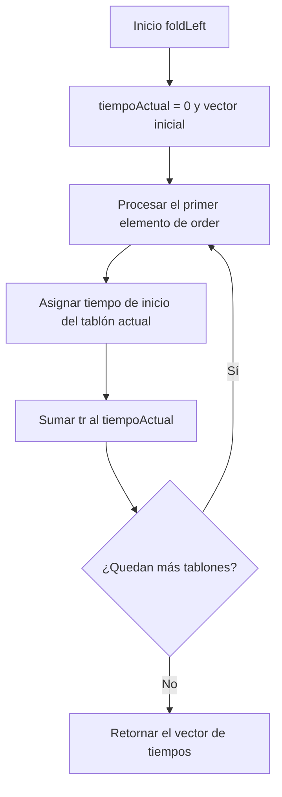
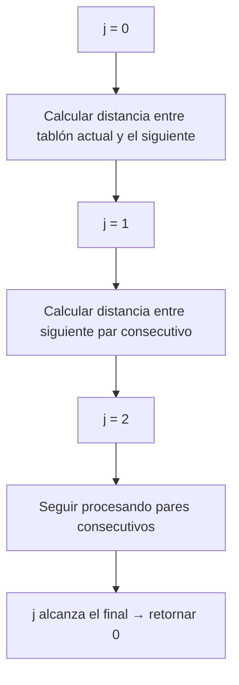
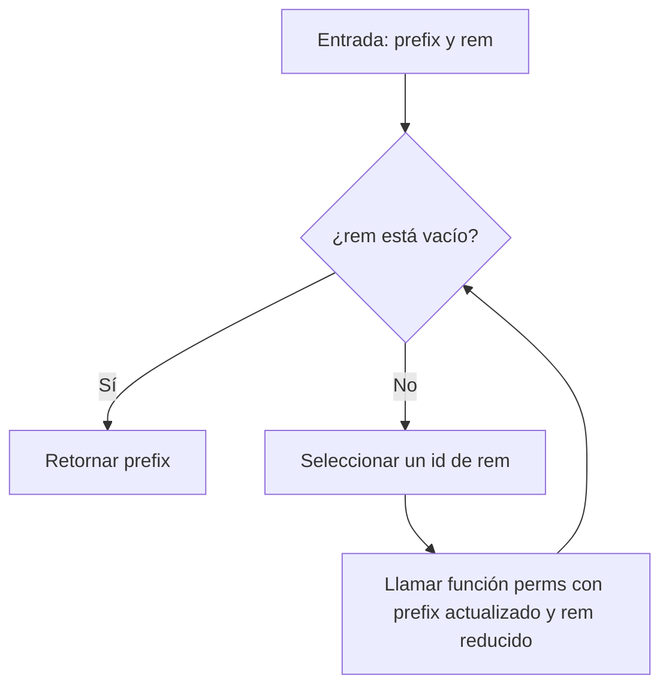
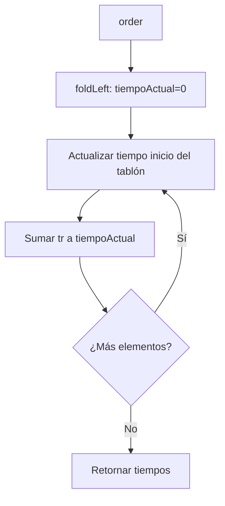
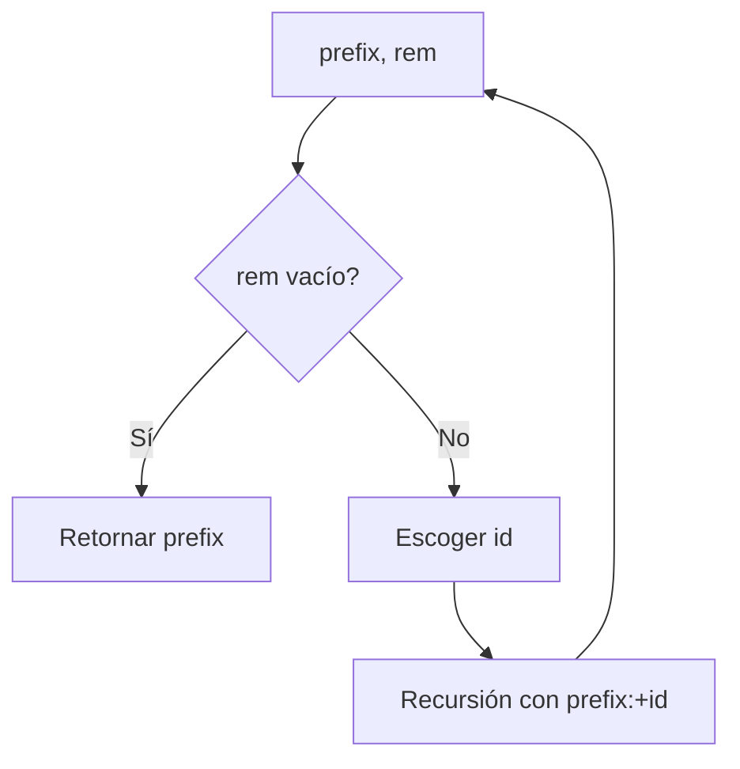
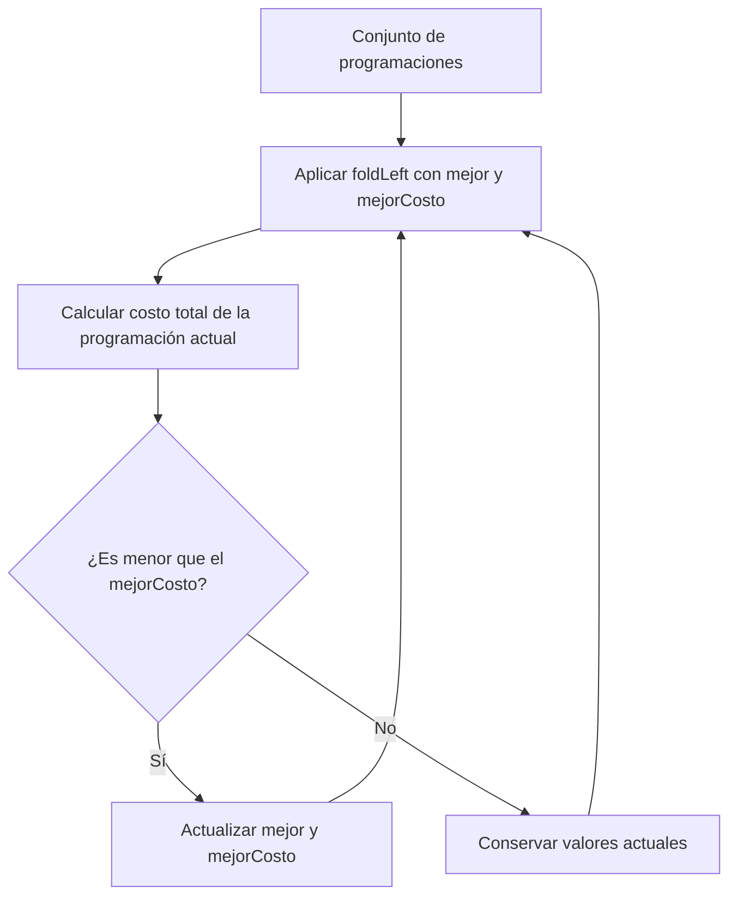

# 📘 Informe de Proceso – Sistema de Riego 
**Programación Funcional – Proyecto Final**

---

##  Introducción

El presente informe describe el **proceso de construcción del sistema secuencial de programación de riego** desarrollado en Scala. El objetivo general del sistema es determinar:

- Los tiempos de inicio de riego para cada tablón.
- El costo total de riego asociado a una programación.
- El costo de movilidad entre tablones.
- La programación óptima (secuencial) que minimiza los costos totales.

El enfoque utilizado se basa estrictamente en **programación funcional**, respetando:

- Inmutabilidad
- Recursión
- Eliminación total de estructuras imperativas (`var`, `while`, `return`, etc.)
- Uso de funciones puras
- Estructuras inmutables como `Vector`

Este documento se enfoca exclusivamente en **el proceso de diseño y construcción del sistema secuencial**, sin incluir paralelización, speedup, Amdahl, benchmarking ni conclusiones finales (que corresponden a otros integrantes del proyecto).

---

##  Diseño general del sistema

El sistema se diseñó de manera modular, dividida en cuatro componentes principales:

1. **RiegoBase.scala**
    - Tiempos de inicio (tIR)
    - Costo por tablón

2. **RiegoCostos.scala**
    - Costo total de riego
    - Costo de movilidad entre tablones

3. **RiegoPermutaciones.scala**
    - Generación recursiva de permutaciones
    - Selección óptima basada en costo secuencial

4. **RiegoIntegracion.scala**
    - Generadores determinísticos de fincas y distancias
    - Validación general del sistema secuencial

El sistema utiliza un modelo de datos simple e inmutable:

- `Tablon = (ts, tr, p)`
- `Finca = Vector[Tablon]`
- `ProgRiego = Vector[Int]`
- `Distancia = Vector[Vector[Int]]`

Este modelo mantiene claridad conceptual y compatibilidad con programación funcional pura.

---

##  Proceso de construcción del módulo base (`RiegoBase.scala`)

Este módulo constituye el núcleo matemático del proyecto.

---

###  Representación de datos

Cada tablón se modela como una tupla:

`(ts_i, tr_i, p_i)`

donde:

- `ts_i`: tiempo límite antes de sufrir
- `tr_i`: tiempo de riego
- `p_i`: penalización por sufrimiento

Una finca es un vector de estos tablones (`Vector[Tablon]`), y una programación es un vector de enteros representando el orden de riego (`ProgRiego`).

---

### Construcción de `tIR_fromOrder`

El objetivo es calcular el tiempo de inicio de cada tablón dadas las reglas:

$$t_{\Pi_{\pi_0}} = 0,\qquad t_{\Pi_{\pi_j}} = t_{\Pi_{\pi_{j-1}}} + tr_{\Pi_{\pi_{j-1}}}$$

Se utilizó `foldLeft` para mantener un diseño totalmente funcional y libre de mutabilidad.

**Diagrama del proceso:**


Ejemplo para `order = [2,0,1]`:
- Tablón 2 inicia en 0
- Tablón 0 inicia en tr₂
- Tablón 1 inicia en tr₂ + tr₀

---
### Construcción de `tIR_fromMapping`

Una programación también puede venir dada como mapping, donde:
```scala
mapping(i) = turno en el que riega el tablón i
```
Para convertirlo en una permutación real:
```scala
order(turno) = idTablon
```
Se usó nuevamente `foldLeft` para mantener la inmutabilidad del vector base.

---
### Función `tIR`
Un wrapper semántico para llamar directamente a `tIR_fromOrder`.

---
### Construcción de `costoRiegoTablon`
Se implementó según las reglas del profesor:
- Caso sin sufrimiento:
Un tablón $i$ no sufre si se cumple la condición:
  $$ts_i - tr_i \ge t_i$$
  En este caso, el costo de riego está dado por:
  $$CR_i = ts_i - (t_i + tr_i)$$

- Caso con sufrimiento:
Si el tablón $i$ inicia riego después del límite permitido:
  $$ts_i - tr_i < t_i$$
  entonces se aplica la penalización proporcional a $p_i$:
  $$CR_i = p_i \cdot \left( (t_i + tr_i) - ts_i \right)$$

El diseño evita condicionales anidados y mantiene claridad lógica.

---
## Proceso del módulo de costos (`RiegoCostos.scala`)
### `costoRiegoFinca`
Se suman los costos individuales usando:
```scala
foldLeft(0)((acc, i) => acc + costoRiegoTablon(i,f,order))
```
Justificación:

- Elimina bucles con estado
- Mantiene inmutabilidad
- Facilita pruebas y composición

### `costoMovilidad`
Se implementó con recursión pura:
```scala
def recorrer(j: Int): Int =
  if (j >= order.length - 1) 0
  else d(order(j))(order(j+1)) + recorrer(j+1)
```
Diagrama del proceso:


---
## Proceso del módulo de permutaciones (`RiegoPermutaciones.scala`)
### Diseño de `generarProgramacionesRiego`
Se implementó una función recursiva basada en:
- `prefix`: permutación en construcción
- `rem`: elementos restantes

Diagrama del algoritmo:


Ventajas del diseño:
- Evita estructuras mutables
- Expresa correctamente la estructura factorial del problema
- Facilita la evaluación secuencial y paralela (en otros módulos)

---
### Selección óptima secuencial

Todas las permutaciones son evaluadas mediante:
```scala
foldLeft((Vector(), Int.MaxValue)) { ... }
```
Cada alternativa evalúa:

- costo total de riego
- costo de movilidad

Y se selecciona la mínima.

Es un enfoque exhaustivo (O(n!)), pero garantiza exactitud para n ≤ 8.

---
## Proceso de integración (`RiegoIntegracion.scala`)
Este módulo introduce:
### Generadores determinísticos
Utilizados para:

- Realizar pruebas controladas
- Reproducir condiciones de evaluación
- Validar integridad del sistema

### Validación del sistema secuencial

Se incluyen funciones de comparación entre componentes del sistema para asegurar consistencia en la lógica base, sin incluir elementos paralelos.

---
## Diagramas Mermaid del proceso global
### Cálculo de tIR

### Permutaciones

### Selección del mejor orden

---
## Reflexión sobre el proceso

El uso de programación funcional ofreció varias ventajas:

- El código es predecible y fácil de razonar.
- La ausencia de estado mutable elimina errores comunes.
- La composición de funciones refleja claramente la lógica del problema.
- `foldLeft` y la recursión permiten expresar algoritmos tradicionales sin efectos secundarios.

Dificultades enfrentadas:

- Evitar completamente estructuras imperativas.
- Manejar la complejidad factorial de permutaciones.
- Diseñar conversiones mapping → orden sin mutabilidad.

Cada una fue resuelta mediante un diseño funcional disciplinado.
