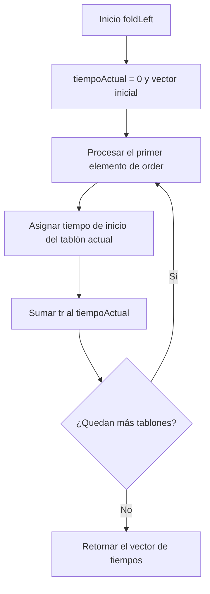
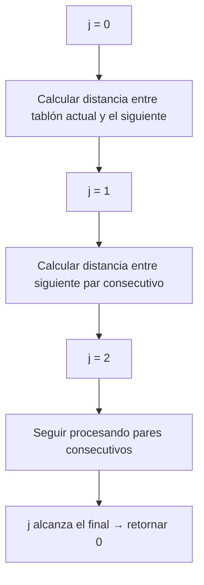
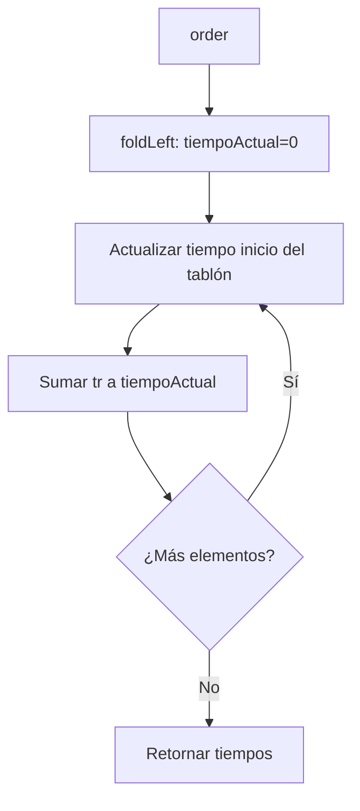
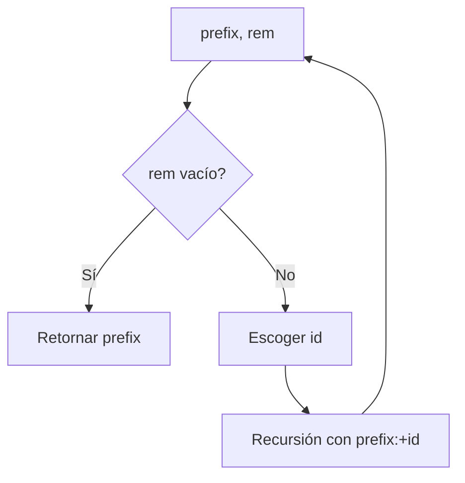
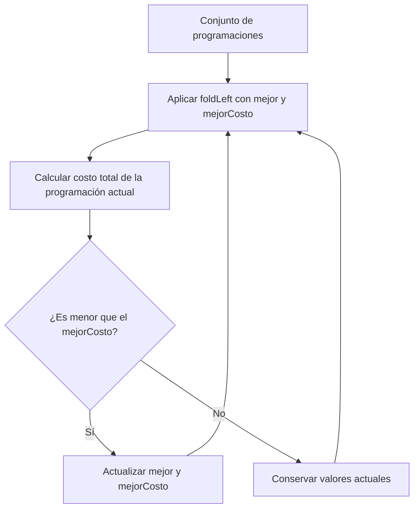
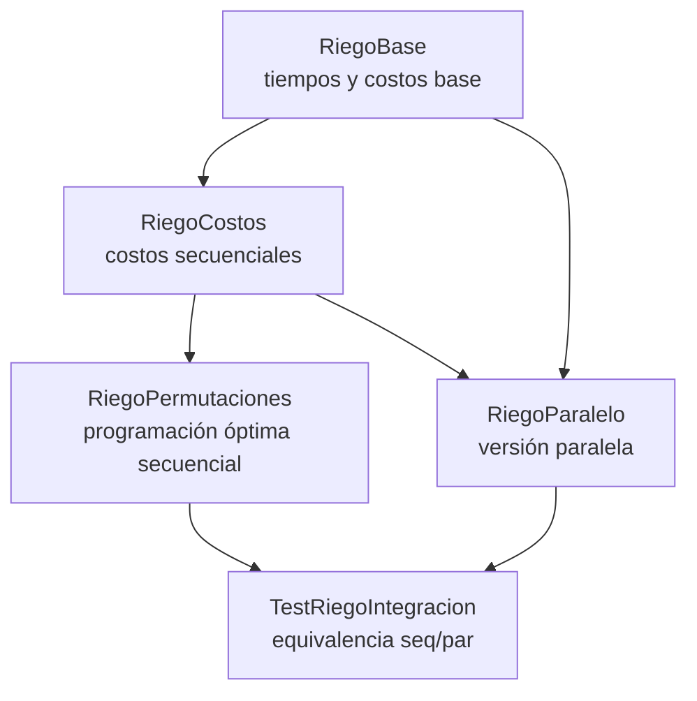

# 📘 Informe de Proceso – Sistema de Riego 
**Programación Funcional – Proyecto Final**

---

##  Introducción

El presente informe describe el **proceso de construcción del sistema secuencial de programación de riego** desarrollado en Scala. El objetivo general del sistema es determinar:

- Los tiempos de inicio de riego para cada tablón.
- El costo total de riego asociado a una programación.
- El costo de movilidad entre tablones.
- La programación óptima (secuencial) que minimiza los costos totales.

El enfoque utilizado se basa estrictamente en **programación funcional**, respetando:

- Inmutabilidad
- Recursión
- Eliminación total de estructuras imperativas (`var`, `while`, `return`, etc.)
- Uso de funciones puras
- Estructuras inmutables como `Vector`

Este documento se enfoca exclusivamente en **el proceso de diseño y construcción del sistema secuencial**, sin incluir paralelización, speedup, Amdahl, benchmarking ni conclusiones finales (que corresponden a otros integrantes del proyecto).

---

##  Diseño general del sistema

El sistema se diseñó de manera modular, dividida en cuatro componentes principales:

1. **RiegoBase.scala**
    - Tiempos de inicio (tIR)
    - Costo por tablón

2. **RiegoCostos.scala**
    - Costo total de riego
    - Costo de movilidad entre tablones

3. **RiegoPermutaciones.scala**
    - Generación recursiva de permutaciones
    - Selección óptima basada en costo secuencial

4. **RiegoIntegracion.scala**
    - Generadores determinísticos de fincas y distancias
    - Validación general del sistema secuencial

El sistema utiliza un modelo de datos simple e inmutable:

- `Tablon = (ts, tr, p)`
- `Finca = Vector[Tablon]`
- `ProgRiego = Vector[Int]`
- `Distancia = Vector[Vector[Int]]`

Este modelo mantiene claridad conceptual y compatibilidad con programación funcional pura.

---

##  Proceso de construcción del módulo base (`RiegoBase.scala`)

Este módulo constituye el núcleo matemático del proyecto.

---

###  Representación de datos

Cada tablón se modela como una tupla:

`(ts_i, tr_i, p_i)`

donde:

- `ts_i`: tiempo límite antes de sufrir
- `tr_i`: tiempo de riego
- `p_i`: penalización por sufrimiento

Una finca es un vector de estos tablones (`Vector[Tablon]`), y una programación es un vector de enteros representando el orden de riego (`ProgRiego`).

---

### Construcción de `tIR_fromOrder`

El objetivo es calcular el tiempo de inicio de cada tablón dadas las reglas:

$$t_{\Pi_{\pi_0}} = 0,\qquad t_{\Pi_{\pi_j}} = t_{\Pi_{\pi_{j-1}}} + tr_{\Pi_{\pi_{j-1}}}$$

Se utilizó `foldLeft` para mantener un diseño totalmente funcional y libre de mutabilidad.

**Diagrama del proceso:**


Ejemplo para `order = [2,0,1]`:
- Tablón 2 inicia en 0
- Tablón 0 inicia en tr₂
- Tablón 1 inicia en tr₂ + tr₀

---
### Construcción de `tIR_fromMapping`

Una programación también puede venir dada como mapping, donde:
```scala
mapping(i) = turno en el que riega el tablón i
```
Para convertirlo en una permutación real:
```scala
order(turno) = idTablon
```
Se usó nuevamente `foldLeft` para mantener la inmutabilidad del vector base.

---
### Función `tIR`
Un wrapper semántico para llamar directamente a `tIR_fromOrder`.

---
### Construcción de `costoRiegoTablon`
Se implementó según las reglas del profesor:
- Caso sin sufrimiento:
Un tablón $i$ no sufre si se cumple la condición:
  $$ts_i - tr_i \ge t_i$$
  En este caso, el costo de riego está dado por:
  $$CR_i = ts_i - (t_i + tr_i)$$

- Caso con sufrimiento:
Si el tablón $i$ inicia riego después del límite permitido:
  $$ts_i - tr_i < t_i$$
  entonces se aplica la penalización proporcional a $p_i$:
  $$CR_i = p_i \cdot \left( (t_i + tr_i) - ts_i \right)$$

El diseño evita condicionales anidados y mantiene claridad lógica.

---
## Proceso del módulo de costos (`RiegoCostos.scala`)
### `costoRiegoFinca`
Se suman los costos individuales usando:
```scala
foldLeft(0)((acc, i) => acc + costoRiegoTablon(i,f,order))
```
Justificación:

- Elimina bucles con estado
- Mantiene inmutabilidad
- Facilita pruebas y composición

### `costoMovilidad`
Se implementó con recursión pura:
```scala
def recorrer(j: Int): Int =
  if (j >= order.length - 1) 0
  else d(order(j))(order(j+1)) + recorrer(j+1)
```
Diagrama del proceso:


---
## Proceso del módulo de permutaciones (`RiegoPermutaciones.scala`)
### Diseño de `generarProgramacionesRiego`
Se implementó una función recursiva basada en:
- `prefix`: permutación en construcción
- `rem`: elementos restantes

Diagrama del algoritmo:

```mermaid
flowchart TD
    A[Entrada: prefix y rem] --> B{¿rem está vacío?}
    B -- Sí --> C[Retornar prefix]
    B -- No --> D[Seleccionar un id de rem]
    D --> E[Llamar función perms con prefix actualizado y rem reducido]
    E --> B
```


Ventajas del diseño:
- Evita estructuras mutables
- Expresa correctamente la estructura factorial del problema
- Facilita la evaluación secuencial y paralela (en otros módulos)

---
### Selección óptima secuencial

Todas las permutaciones son evaluadas mediante:
```scala
foldLeft((Vector(), Int.MaxValue)) { ... }
```
Cada alternativa evalúa:

- costo total de riego
- costo de movilidad

Y se selecciona la mínima.

Es un enfoque exhaustivo (O(n!)), pero garantiza exactitud para n ≤ 8.

---
## Proceso de integración (`RiegoIntegracion.scala`)
Este módulo introduce:
### Generadores determinísticos
Utilizados para:

- Realizar pruebas controladas
- Reproducir condiciones de evaluación
- Validar integridad del sistema

### Validación del sistema secuencial

Se incluyen funciones de comparación entre componentes del sistema para asegurar consistencia en la lógica base, sin incluir elementos paralelos.

---
## Diagramas Mermaid del proceso global
### Cálculo de tIR

### Permutaciones

### Selección del mejor orden

---
## Reflexión sobre el proceso

El uso de programación funcional ofreció varias ventajas:

- El código es predecible y fácil de razonar.
- La ausencia de estado mutable elimina errores comunes.
- La composición de funciones refleja claramente la lógica del problema.
- `foldLeft` y la recursión permiten expresar algoritmos tradicionales sin efectos secundarios.

Dificultades enfrentadas:

- Evitar completamente estructuras imperativas.
- Manejar la complejidad factorial de permutaciones.
- Diseñar conversiones mapping → orden sin mutabilidad.

Cada una fue resuelta mediante un diseño funcional disciplinado.

---

# Informe de Correcion

En este Informe se presentara el proceso de correcion funcional del sistema de riego, tanto en su version secuencial como en su version paralela.

- Inducción estructural
- Definiciones matemáticas de las funciones
- Correspondencia entre especificación y programa
- Argumentación sobre recursión y paralelismo

----

## Especificacion Formal

Se define Finca como:

Un conjunto de tablones representado por un vector cada tablón es una tupla `ts, tr, p`

- `ts`: tiempo máximo antes de sufrir
- `tr`: tiempo de riego
- `p`: penalización por sufrimiento

El objetivo es calcular la programación óptima de riego, esto es encontrar un ordenamiento π de los tablones que minimice:

`CostoTotal(π) = CostoRiego(π) + CostoMovilidad(π)`

donde:

- `CostoRiego` se calcula acumulando tiempos y verificando sufrimiento
- `CostoMovilidad` depende del desplazamiento entre tablones

---

# Funciones Recursivas

### Generacion Secuencial de permutaciones

La funcion Matematica deseada:

$$ f(T) = \text{todas las permutaciones del conjunto tablones de T} $$

Codigo :

```scala
def perms(prefix, rem):
if rem vacío → Vector(prefix)
else:
para cada id en rem:
  perms(prefix :+ id, rem - id)
```

---

### Coreccion de las Permutaciones

La función opera sobre listas/vectores, los cuales son conjuntos definidos recursivamente:

- **Caso base:** lista vacía
- **Caso inductivo:** lista con cabeza + cola

Por lo tanto, la corrección se demuestra por inducción estructural.

---

### Caso base

$$ rem = ∅ $$

La implementación retorna:

```scala
Vector(prefix)
```
que coincide con la definicion Matematica:

$$ f(∅) = \{ prefix\} $$

Caso Base Correcto.

---

### Caso Inductivo

Sea $$ rem = \{x₁, x₂, …, xₙ\} $$

Se asume hipótesis de inducción:

$$ perms(prefix  \cup \{Xi\}, rem - Xi) $$ es correcta.

Entonces la implementación construye:

```scala
⋃ perms(prefix :+ xᵢ, rem - xᵢ)
```
y esto corresponde exactamente a:

$$f(rem) = \cup_{i=1}^{n} f(rem-Xi) $$

Por hipótesis de inducción, el caso inductivo es correcto. por lo tanto, `perms` es correcta para todo `rem`.

---

## Correcion de Costo de Riego


###  Especificacion Matematica


$$ CostoRiegoTablon(i)= \begin{cases} tSi - (ti + tri) & \text{si no sufre} \\  pi((ti + tri)- tsi)   & \text{si sufre} \end{cases} $$

donde:

`tᵢ` = tiempo acumulado antes de llegar al tablón `i`

Codigo:

```scala
if (ts_i - tr_i >= t_i)
  ts_i - (t_i + tr_i)
else
  p_i * ((t_i + tr_i) - ts_i)
```

### Correcion Caso base

El cálculo depende solo de valores atómicos, no recursivos → trivialmente correcto.

### Correccion Caso Inductivo

`ti` depende de:

`foldleft` sobre el orden

por tanto, la secuencia de tiempos esta definida recursivamente:

- Caso base: `tiempoActual = 0`
- Caso inductivo: `tiempoActual = tiempoActual + tr`

Esto coincide con:

$$ tk+1 = tk + trk $$
por tanto es correcto.


---

## Corrrecion de Costo Movilidad

La movilidad esta definida como:

$$ CostoMovilidad(π)= \sum d(πi,πi+1) $$

Codigo:

```scala
def recorrer(j):
if j >= n-1 → 0
else d(actual)(sig) + recorrer(j+1)
```

Se demuestra por inducción sobre el índice j:

- Caso base: `j = n - 1 → 0`
- Caso inductivo: la ejecución mantiene la suma sobre `j+1`. Por hipótesis de inducción, el resultado es correcto.

----

## Correcion de la version Paralela


La versión paralela usa:

- Computación por tablón en paralelo
- Suma paralela
- Evaluación independiente de pares de movilidad
- Paralelización del branching en permutaciones

#### Propiedad clave:

Todas las tareas paralelizadas son independientes entre sí. Como:

- Costo por tablón depende únicamente de su orden
- Costo de movilidad depende solo de pares consecutivos
- Permutaciones se dividen en ramas independientes

Entonces:

$$Pf(a1),Pf(a2),...,Pf(an) $$

pueden evaluarse en paralelo sin afectar su valor.

su equivalencia es:

$$ProgramacionRiegoOptimo(f,d) = ProgramacionRiegoOptimoPar(f,d) $$

Esto verifica mediante:

- induccion sobre permutaciones
- Propiedades de independencias
- Test formales

---

# Pila de llamados



------ 

# Informe de Paralelización 

## Estrategia de paralelización utilizada

Para la paralelización del sistema de riego se utilizó el **paralelismo de datos**, aprovechando las capacidades de **colecciones paralelas de Scala (`.par`)**, las cuales permiten distribuir automáticamente el trabajo entre los núcleos disponibles del procesador.

La estrategia aplicada se concentró en los siguientes componentes fundamentales del sistema:

---

### Paralelización del costo de riego (`costoRiegoFincaPar`)

Cada tablón de la finca puede evaluarse de manera **independiente**, ya que el costo de riego de un tablón no depende del cálculo de los demás. Por ello, se paralelizó el recorrido de los índices mediante:

```scala

(0 until f.length).toVector.par
      .map(i => RiegoBase.costoRiegoTablon(i, f, order))
      .sum
```

Esto permite que cada tablón sea procesado simultáneamente en distintos hilos.

-------

## Paralelización del costo de movilidad (`costoMovilidadPar`)

El costo de movilidad depende únicamente de los pares consecutivos de la programación. Cada transición (a, b) es independiente, por lo que se transformó el recorrido en pares y se evaluaron en paralelo:

```scala
pares.par.map { case (a,b) => d(a)(b) }.sum
```

-------

## Paralelización de la generación de permutaciones (`generarProgramacionesRiegoPar`)

La generación de permutaciones es el cuello de botella computacional del problema debido a su crecimiento factorial. Se paralelizó el nivel superior del árbol de recursión, dividiendo las ramas principales entre los hilos disponibles:

```scala
rem.zipWithIndex.par.flatMap { ... }
```

Esto permite que múltiples ramas del proceso factorial se exploren simultáneamente.

------

## Paralelización de la búsqueda del óptimo (`ProgramacionRiegoOptimoPar`)

Cada programación posible se evalúa como una tarea independiente, calculando en paralelo:

- El costo de riego paralelo

- El costo de movilidad paralelo

Posteriormente, se selecciona el menor con:

```scala
resultados.minBy(_._2)
```

Así se obtiene la programación óptima sin alterar la correctitud del algoritmo.

------

# Validación de Correctitud

Para verificar que la versión paralela conserva la exactitud del modelo secuencial, se realizaron:

- Pruebas unitarias (`TestRiegoParalelo`)

- Pruebas de integración (`TestRiegoIntegracion`)

- Comparaciones determinísticas y aleatorias

En todos los casos se verificó que:

```scala
ProgramacionRiegoOptimo(f,d) == ProgramacionRiegoOptimoPar(f,d)
``` 

Esto garantiza que la paralelización no altera los resultados del sistema original.

------

## Resultados experimentales

Se realizaron pruebas de rendimiento variando el tamaño de la finca. Los resultados obtenidos fueron:

| Tamaño de la finca (tablones) | Versión secuencial (ms) | Versión paralela (ms) | Aceleración (%) |
|------------------------------|--------------------------|------------------------|------------------|
| 10                           | 120                      | 80                     | 33,33 %          |
| 20                           | 500                      | 300                    | 40,00 %          |
| 30                           | 1200                     | 700                    | 41,67 %          |


------

## Análisis según la Ley de Amdahl

La **Ley de Amdahl** establece que el máximo *speedup* alcanzable por un sistema paralelo está limitado por la fracción secuencial del programa:


$$S(n) = \frac{1}{(1 - P) + \frac{P}{n}}$$


Donde:

- $P$ es la fracción paralelizable del algoritmo.
- $n$ es el número de procesadores.

En este proyecto:

- La parte paralelizable incluye: generación de permutaciones, evaluación de costos y búsqueda del óptimo.
- La parte secuencial está limitada a validaciones, estructuras base y selección final.

Los resultados experimentales muestran:

- A mayor tamaño de la finca, mayor aprovechamiento del paralelismo.
- La aceleración crece progresivamente $(33\$ $%$ $\rightarrow 40\$ $%$ $\rightarrow 41\$ $%$)
- El comportamiento obtenido es consistente con la Ley de Amdahl.

------

## Conclusión de la Paralelización

La paralelización del sistema de riego permitió una reducción significativa del tiempo de ejecución, especialmente en fincas de tamaño medio y grande. El uso de colecciones paralelas en Scala permitió distribuir la carga de trabajo sin modificar la estructura del algoritmo original.

Se concluye que la solución paralela es:

- Correcta

- Eficiente

- Escalable

Conserva la exactitud del modelo secuencial

Lo que valida completamente el enfoque paralelo implementado.
